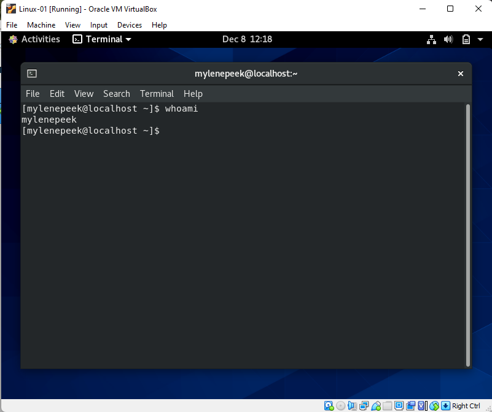

# Installing a VM
Installeer een virtuele machine en gebruik de CLI

## Keyterms
VM - virtuele machine.  
GUI - graphical user interface.  
CLI - command line interface  

## Opdracht
Zet een VM op met een Ubuntu/CentOS. Ondek in de virtuele machine wat je gebruikersnaam is.

### Gebruikte bronnen
https://askubuntu.com/questions/413594/what-does-no-bootable-medium-found-mean-in-virtualbo

### Ervaren problemen
Document niet goed lezen en vergeten de virtuele installatie disc te installeren. 

### Resultaat
VM opgezet in virtual box. Command whoami uitgevoerd. 
