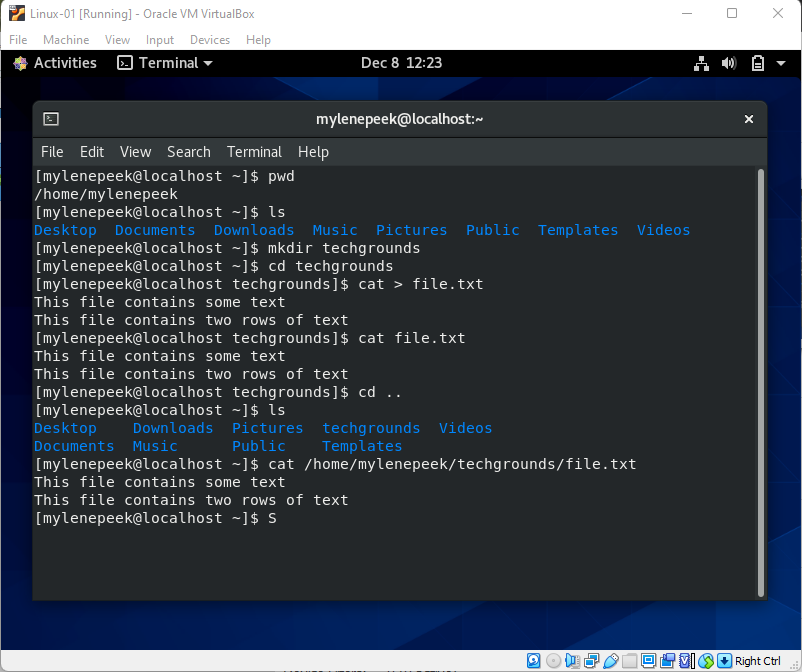

# Files and directories
De CLI gebruiken om de directories te beheren. 

## Keyterms
directory - folder  
absolute path - Specifiek benoemde locatie van een file of directory vanaf de root locatie.  
relative path - een path die relateerd aan de present working directory (pwd).

## Opdracht
Vind je huidige directory, maak een nieuwe directory aan en creëer een file met wat text. Verplaats op 3 verschillende manieren door je directory. 

### Gebruikte bronnen
- [Cheat-sheet] (https://www.guru99.com/linux-commands-cheat-sheet.html)

### Ervaren problemen
Geen ervaren problemen. 

### Resultaat
Nieuwe directory aangemaakt met een textbestand met tekst. 
