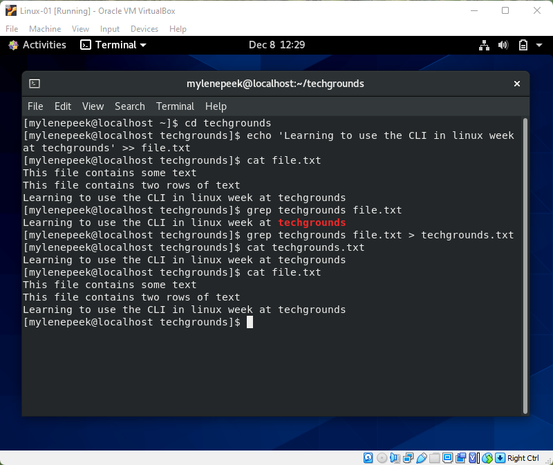

# Working with text (CLI)
Textbestand aanpassen in de CLI.

## Keyterms
- Regular Expressions - Commands en gereedschappen die regelmatig gebruikt worden in scripts; zoals: grep, expr, sed en awk. 
- stdin - standard input. 
- stdout - standard ouput. 
- echo - Laat een direct bericht zien op het scherm; schrijft iedere string naar een standard output, met een spatie tussen elke nieuwe zin na de vorige. 
- '>>' - Append, voeg toe aan de file. 

## Opdracht
Gebruik het echo command om een nieuwe zin in je textfile met het woord 'techgrounds' te zetten via de CLI. Gebruik een command om enkel de zin met het woord 'techgrounds' te lezen. Lees de textfile met de zin met techgrounds gefilterd en verplaats de uitkomst naar een nieuw bestand genaamd 'techgrounds.txt'. 

### Gebruikte bronnen
- echo man page
- grep man page
- [Bash-scripting](https://tldp.org/LDP/abs/html/textproc.html)

### Ervaren problemen

### Resultaat
Door middel van gebruik van regular expressions text in bestand toegevoegd en specifieke zin naar ander bestand overgezet. 

