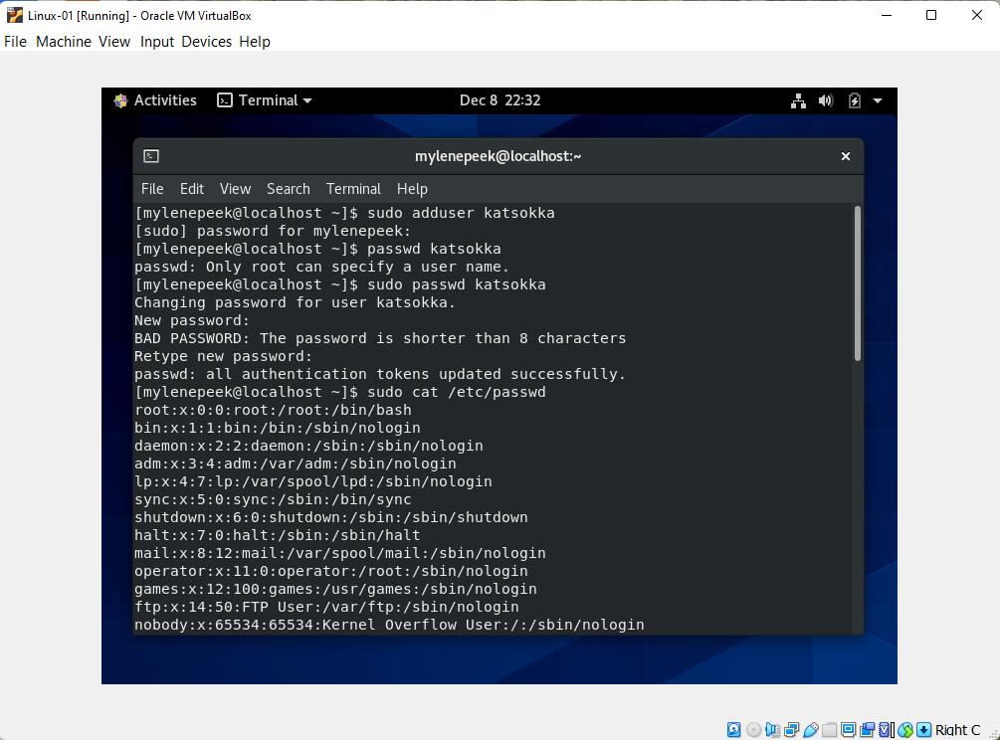
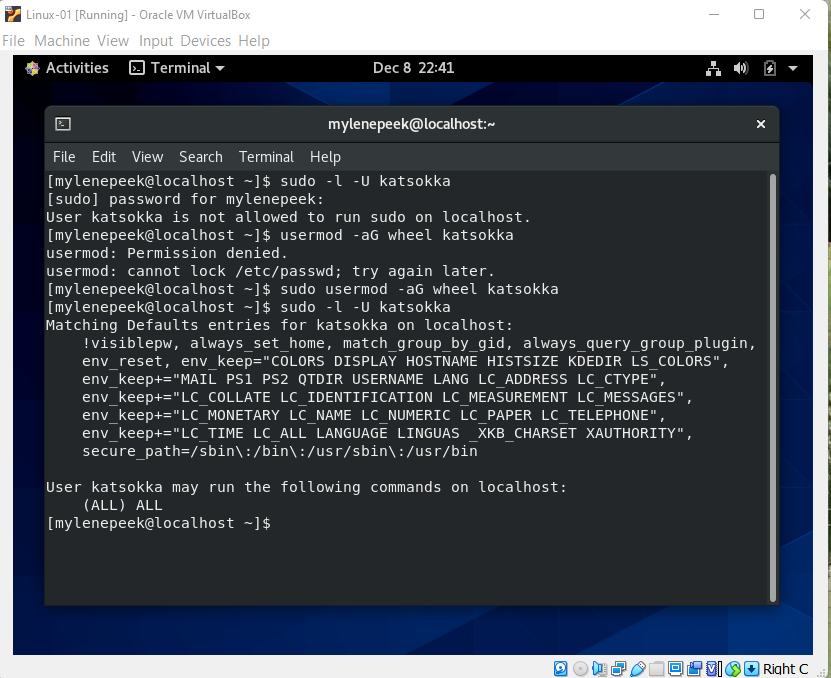

# Users and groups
Linux maakt gebruik van verschillende gebruikers. De gebruikers zijn in groepen in te delen. 

## Keyterms
Root - Root user mag alles doen.   
Sudo - command om tijdelijke root permissons te krijgen.  
Wheel - Users in de wheel groep krijgen automatisch sudo privileges. 

## Opdracht
Maak een nieuwe user aan in je VM
- User moet onderdeel zijn van admin groep.
- User moet een wachtwoord hebben.
- User moet sudo command kunnen gebruiken. 
Localiseer de bestanden die users, wachtwoorden, en groepen bijhouden. Kijk of daar een of je je nieuwe user kan vinden. 

### Gebruikte bronnen
https://www.howtogeek.com/50787/add-a-user-to-a-group-or-second-group-on-linux/
https://devconnected.com/how-to-list-users-and-groups-on-linux/#a_List_Usernames_using_cut
https://phoenixnap.com/kb/how-to-create-add-sudo-user-centos

### Ervaren problemen
Wachtwoord moest met ander command toegevoegd worden. 

### Resultaat
useradd (user)
groupadd (group)
usermod -g (group)(user)
/etc/passwd 

Via adduser een nieuwe user toegevoegd, deze een wachtwoord gegeven en door middel van gebruik van cat /etc/passwd de bestanden van de user opgezocht.

Onderzocht of de nieuwe user sudo command mocht uitvoeren. Nieuwe user rechten regeven om sudo command uit te voeren. 
