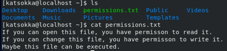
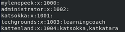

# File Permissions
Verander de toegangen van een bestand. 

## Keyterms
- Permissons - Toestemmingen 
- Ownership - Eigenaar van bestand/file 
- chmod - Verander file of directory permissies 
- chown - Verander de ownership van files of directories 

## Opdracht
- Maak een text bestand. 
- Maak een lange lijst om de file permissions te zien. Wie is de eigenaar van de groep en welke toestemmingen heeft deze?
- Maak het bestand uitvoerbaar door execute permissions te geven. 
- Verwijder de write and read permissons van de groep en iedereen behalve de eigenaar. Check of je het kan lezen. 
- Verander eigenaar van de file naar een andere user. Check of je het niet kan lezen, tenzij je root permissions hebt. 
- Verander het ownership van de file naar een andere groep. 

### Gebruikte bronnen
- [users-groups](https://www.howtogeek.com/50787/add-a-user-to-a-group-or-second-group-on-linux/)
- man chmod
- man chown

### Ervaren problemen
Geen problemen ervaren.

### Resultaat
Groepen aangemaakt en verschillende users aangemaakt. Textbestand aangemaakt door user.

``` bash
sudo groupadd kattenland
sudo usermod -a -G kattenland katsokka
cat > permissions.txt
ls -l 
sudo chown katsokka:kattenland permissions.txt
su katsokka
chmod katsokka u+x permissions.txt
chmod kattenland g-rw permissions.txt
``` 

Katsokka het document uit laten lezen.



Verschillende users aan groups toegewezen.

