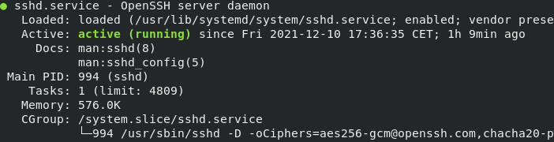

# Processes
Uitzoeken hoeveel geheugen een process gebruikt en deze uitzetten. 

## Keyterms
Process - Het uitvoeren van code  
Deamons - Draait op de achtergrond en is niet interactief.  
Services - Reageert op vraag van programma's kan interactief zijn 
Programs - Wordt gedraaid door de gebruiker.  
Ssh - Secure shell.  
PID - Bestand met het proces indentificatie nummer. 

## Opdracht
- Start ssh daemon.
- Vind de PID van de ssh daemon.
- Zoek uit hoeveel memory de sshd aan het gebruiken is.
- Stop of kill het sshd proces. 

### Gebruikte bronnen
https://www.cyberciti.biz/faq/centos-stop-start-restart-sshd-command/

### Ervaren problemen

### Resultaat
Sshd opgestart, de status opgezocht en vervolgens gestopt. 

`sudo systemctl start sshd.service`
`sudo systemctl status sshd.service`
`sudo systemctl stop sshd.service`

