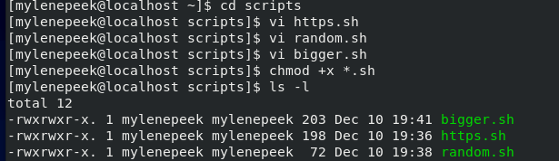
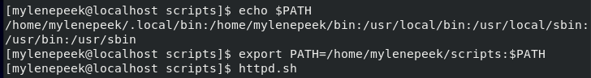
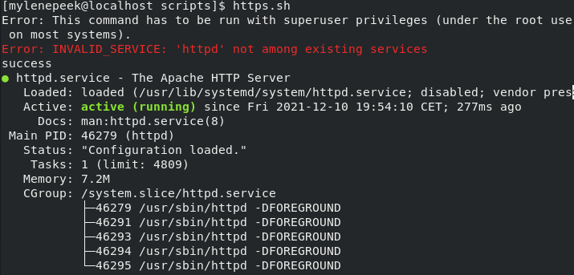

# Bash scripting
Een script met bash commands voor het uitvoeren.

## Keyterms
.sh - filename voor een script.  
PATH variable - systeem variabele die de OS gebruikt om nodige locaties te vinden om van de CLI uitvoerbaar maakt.

## Opdracht
1. httpd server.
    - Maak een directory 'scripts' en plaats alle scripts in die directory.
    - Voeg de scripts directory aan de PATH variable toe.P
    - Maak een script dat een zin toevoegd aan een file, wanneer deze uitgevoerd wordt.
    - Maak eenscript dat een httpd package installeerd, activeerd en de httpd mogelijk maakt. Het script moet de httpd status in de terminal printen. 
2. random nummer.
    - Maak een script dat een random nummer genereerd tussen 1 en 10, het in een variable zet en het nummer aan een textfile hangt.
3. grooter nummer.
    - Maak een script dat een random nummer genereerd, het in een variabele zet en het aan alleen aan een textfile hangt als het groter is als 5. Als het nummer kleiner is als 5 moet het een zin in hetzelfde bestand printen

### Gebruikte bronnen
* https://www.digitalocean.com/community/tutorials/how-to-install-the-apache-web-server-on-centos-8 
* https://stackoverflow.com/questions/8988824/generating-random-number-between-1-and-10-in-bash-shell-script
* https://askubuntu.com/questions/551990/what-does-path-mean

### Ervaren problemen
* PATH variable

### Resultaat
* Nieuwe directory voor scripts aangemaakt. Scripts toegevoegd in directory: 
    - httpd.sh
    - random.sh
    - bigger.sh. 

* Scripts met chmod +x uitvoerrechten gegeven.
* $PATH variable gemaakt voor scriptdirectory.

* Script uitgevoerd om te kijken of het werkt.

