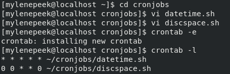

# Cron jobs
Met cron jobs kan je scripts op bepaalde momenten automatisch uitvoeren. 

## Keyterms
Cronjobs - Maakt een job aan op een herhalend schema. 

## Opdracht
- Maak een bash script die de huidige tijd en datum in een bestand in de home directory schrijft. 
- Registreer het script in je crontab zodat het elke minuut draait. 
- Maak een script dat de beschikbare disc space in een log bestand zet in /var/logs. Gebruik een cron job zodat het wekelijks draait. 

### Gebruikte bronnen
* https://www.howtogeek.com/409611/how-to-view-free-disk-space-and-disk-usage-from-the-linux-terminal/ 
* man df
* https://crontab.guru/

### Ervaren problemen
Het juiste path verwoorden waar de cronjob uitgevoerd moet worden.  
Rechten om het te mogen schrijven in var/log. 

### Resultaat
Script datetime en discspace gemaakt, de scripts in een aparte directory gezet en execution permissions gegeven.  

Cronjobs aangemaakt en ingevuld voor de scripts. Na een tijdje getest of de cronjob doet wat verwacht wordt.  

