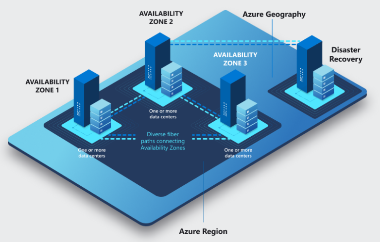

# Global Infrastructure
Azure is als cloudprovider verantwoordelijk voor de fysieke infrastructuur. Azure zorgt op verschillende manieren dat de global infrastructure goed beschermd is.

### Keyterms

* Regions 
    * Latency - De tijd die het kost om data van het ene punt van het netwerk naar een ander punt te verbinden. 
    * Redundancy - systemen worden dubbel voorzien, als een systeem uitvalt neemt een ander syteem het over. 
* Availability Zones 
    * Zone-redundant - automatische replicatie tussen zones
    * Zonelijk - exemplaren die vastgemaakt zijn aan specifieke zone. 
* Region Pairs 
    * GRS - Geo-Redundant Storage

## Opdracht
Beschrijf de Azure Global Infrastrucure.

### Gebruikte bronnen
- [Availability-zones](https://docs.microsoft.com/nl-nl/azure/availability-zones/az-overview)
- [Latency](https://www.cloudflare.com/learning/performance/glossary/what-is-latency/)
- [Cross-region](https://docs.microsoft.com/nl-nl/azure/availability-zones/cross-region-replication-azure)
- [Azure-geografieen](https://azure.microsoft.com/nl-nl/global-infrastructure/geographies/#geographies)
- [Region-services](https://docs.microsoft.com/en-us/azure/availability-zones/region-types-service-categories-azure)

### Resultaat

De Global infrastructure van Azure wordt onderverdeeld in regio's (region) en beschikbaarheidszones (availibility zone). Azure biedt de mogelijkheid om regio paren (region pairs) in te stellen. 

#### Azure Region
Datacenters worden door Azure gegroepeerd in geografische regio's. In elke region zijn meerdere datacenters om te zorgen voor redunantie en beschikbaarheid. 

Kenmerken Azure Region:
* Een Azure region bevat meerdere datacenters en availibility zones.
* Azure region bevat datacenters binnen een latentie-gedefinieerde perimeter, verbonden via dedicated een regionaal netwerk met lage latentie voor de best mogelijke prestatie en beveiliging.

De beschikbaarheid van services onder Azure regions is afhankelijk van het regiotype.
* Recommended
    * Meeste service mogelijkheden en ondersteunen availibility zones.
* Alternate 
    * Regio's breiden de voetafdruk van Azure uit binnen een gegevensresidentiegrens waar momenteel een aanbevolen regio bestaat. 
    * Helpen het optimaliseren van latency en zorgen voor een tweede regio voor lokale fouten maar suporten geen availibility zones.
    * Azure controleerd regelmatig of alternatieve regio's aangeraden regio's moeten worden. 

Azure Services zijn onderverdeeld in drie categorieën:
* Foundational
    * Beschikbaar in alle recommended en alternate regio's wanneer een regio beschikbaar is, of binnen 90 dagen of een nieuw fundementele service generaal beschikbaar wordt. 
* Mainstream
    * Beschikbaar in alle recommended regio's binnen 90 dagen van de regio generale beschikbaarheid. 
    * Vraaggestuurd in alternative regio's, veel zijn al geïmplementeerd in een subnet van alternative regio's
* Stratigic
    * Gerichte serviceaanbiedingen, vaak branchegericht of ondersteund door aangepaste hardware. Vraaggestuurde in verschillende regio's, en veel zijn al geïmplementeerd in een subset van aanbevolen regio's.

#### Azure Availability Zone
Fysiek gescheiden locaties binnen elke Azure-regio die tolerant zijn voor lokale fouten[^1]. Om dit te garanderen zijn er minimaal drie afzonderlijke beschikbaarheidszones aanwezig in alle regio's met deze zones.

Kenmerken Azure Availibility Zone:
* Azure Availibility Zones zijn verbonden via een netwerk met een retourlatentie van minder dan 2ms, om data gesynchoniseerd en bereikbaar te houden.
* Zone bestaat uit een of meer datacenters[^2].
* Regionale sevices, capiciteit en hoge beschikbaarheid blijven ondersteund door de resterende zones, mocht er één zone beïnvloed worden. 
* Availibility zones zijn zeer beschikbaar, fouttollerant en schaalbaarder dan traditionele infrastructuur
   * Wanneer er van zones gewisseld wordt, gaat dit automatisch, zonder onderbrekingen.
   * Reken-, opslag-, netwerk-, en gegevensbronnen kunnen gerepliceerd worden en in een andere beschikbaarheidszones.
* Azure-services met beschikbaarheidszones kunnen op 2 manieren worden geconfigureerd
   * Zone-redunant
   * Zonelijk. 

Drie types Azure services die availibility zones ondersteunen:
* Zonal services
    * Resource kan in een specifieke, zelfgekoze availibility zone geïmplementeerd worden.
* Zone-redunant service
    * Resources worden automatisch gekopiëerd of gedistbeerd tussen zones.
* Always-availible services
    * Altijd beschikbaar binnen alle Azure geografieën en zijn bestand tegen zone-breed outages en regio-brede outages.  

[^1]: Variëren van software- en hardwarefouten tot aardbevingen, overstromingen en brand.
[^2]: Onafhankelijke stroomvoorziening, koeling en netwerkinfrastructuur.

#### Azure Region Pair
Elke Azure regio is met een andere regio verbinden binnen dezelde geografie (Azie, Europa, VS). Dit staat replicatie van resources toe met een geografische afstand die de kans op een outage in beide regio's tegelijk zeer onwaarschijnlijk maken. 

Azure GRS:
* Kopiëerd automatisch gegevens naar een secundaire regio.
* Niet alle Azure-services repliceren automatisch gegevens of vallen automatisch terug van een failed region om kruis-replictie naar een andere beschikbare regio.
* Verzekerd optimaale bereikbaarheid voor toepassingen en minimale herstel tijd als er een gebeurtenis is die de beschikbaarheid beïnvloed. 

Shared responsibility model:
* Recovery en replication moeten door de gebruiker geconfigureerd worden. 
  * Sterk aangeraden om te profiteren van isolatie en beschikbaarheid te verbeteren.

Voordelen cross-region replication: 
* Herstelreeks - als er een storing optreed in de geografie krijgt het herstel van een regio prioriteit van elk ingeschakelde set regio's. Ingeschakelde regiosets hebben gegarandeerd een van de regio's met prioriteit.
* Sequentieel - systeemupdates voor de regio's zijn chronologisch ingedeeld om downtime te minimaliseren, impact van bugs en logische fouten in het zeldzame geval van een mislukte update te minimaliseren. 
* Fysieke isolatie - Azure streeft naar een fysieke afstand van minimaal 483 kilometer tussen de datacenters van de ingeschakelde regio's [^3]. 
* Gegevensstatus - Regio's bevinden zich binnen dezelfde geografie als hun ingeschakelde set, om data residency regelgeving voor belasting en wet en regelgeving. 

Region pairs datacenters Europa:

| Geografie | paar A | paar B |
| ----- | --------- | -------- |
| Europa | Europa - noord (Ierland) | Europa - west (Nederland) |
| Duisland | Duitsland - west-centraal | Duitsland - noord[^4] |
| Noorwegen | Noorwegen - oost | Noorwegen west[^4] |
    
[^3]: Verminderd de kans dat natuurrampen, rampen, stroomuitval of fysieke netwerkuitval van invloed kan zijn op meerdere regio's. Ondanks dat dit beperkingen heeft binnen geografie, beschikbaarheid van stroom- of netwerkinfrastructuur en regelgeving. 
[^4]: Sommige regio's hebben alleen toegang ter ondersteuning van specifieke klantsenario's, zoals binnenlands noodherstel. Aanvraag kan gedaan worden via Azure Portal. 