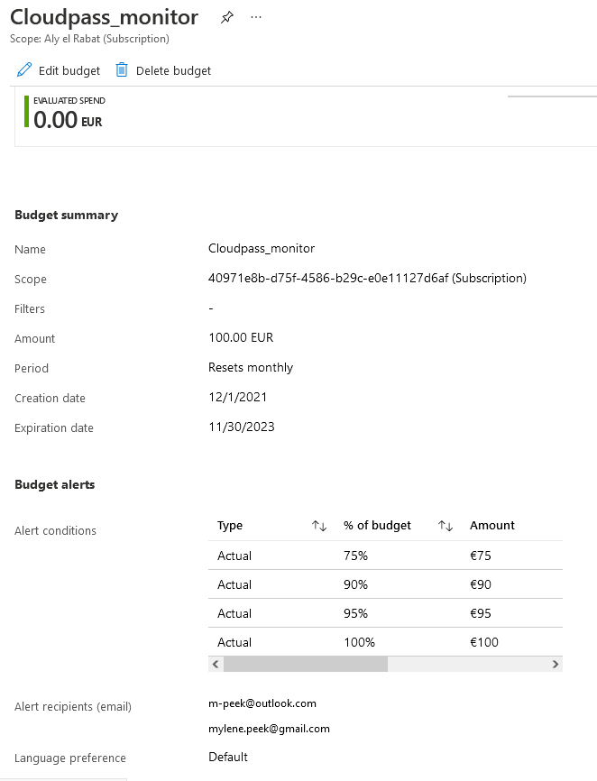

# Cost Management
De cloud kent als voordeel dat het voor veel kostenbesparing zorgt. Azure biedt verschillende opties om de kosten inzichtelijk te maken. 

### Keyterms
* Azure principles for costmanagement
* Free subscription
* Pay-as-you-go
* OpEx - Operational Expenditure
* CapEx - Capital Expenditure
* TCO - Total Cost of Ownership
    * TCO-calculator

## Opdracht
Begrip van de opties die Azure aanbied om kosten inzichtelijk te maken.

### Gebruikte bronnen
- [Cost-management](https://azure.microsoft.com/en-us/services/cost-management/#overview)
- [TCO-calculator](https://azure.microsoft.com/en-us/pricing/tco/calculator/)
- [TCO-AzureCosmos](https://docs.microsoft.com/en-us/azure/cosmos-db/total-cost-ownership)
- [Capex-vs-opex](https://www.azureguru.org/capex-vs-opex/)
- [Learn-fundamentals](https://docs.microsoft.com/en-us/learn/modules/fundamental-azure-concepts/)
- [Overview-cost](https://docs.microsoft.com/en-us/azure/cost-management-billing/cost-management-billing-overview)
- [Free-subscription](https://docs.microsoft.com/nl-nl/azure/cost-management-billing/manage/create-free-services)

### Resultaat
Kosten van gebruik zijn afhankelijk van het soort service die afgenomen wordt bij Azure. 

#### Cloud computing
Er zijn drie soorten cloud computing te onderscheiden.

| Model | Beschrijving |
| -------| ------- |
| Public cloud | Cloud resources [^1] zijn van en operated bij een derde partij clouds service provider en worden over het internet geleverd | 
| Private cloud | Resources zijn exclusief gebruikt voor gebruikers van één bedrijf of organisatie |
| Hybrid cloud | Een hybride cloud is een omgeving dat de public en private cloud samenbrengt door data en aplicaties te delen tussen de solutions. |

- Public cloud
    - Geen grote uitgave om op te schalen.
    - Toepassingen kunnen snel ontworpen en uitgerold worden. 
    - Bedrijven betalen voor wat ze gebruiken.
- Private cloud 
    - Hardware moet gekocht worden voor start-up en maintenance.
    - Bedrijven hebben complete controle over hun resources en security.
    - Bedrijven zijn verandwoordelijk voor hardware onderhoud en updates.
- Hybrid cloud 
    - Zorgt voor de meeste flexibiliteit
    - Bedrijven bepalen waar ze hun toepassingen uitvoeren
    - Bedrijven hebben controle over security, naleving of wettelijke vereisten. 
[^1]: servers en opslag. 

#### Types Cloud computing services
Er zijn drie cloud computing services te onderscheiden. Elke service heeft zijn verantwoordelijkheden voor de cloudprovider en de gebruiker (shared responsibility model).

##### IaaS | Infrastructure-as-a-Service.
* Cloud provider houd de hardware up-to-date.
    * Agility (kan snel toegankelijk gemaakt en uitgerold worden)
    * Management
    * Consumption based model
    * Skills
    * Cloud voordelen
    * Flexibiliteit

##### PaaS | Platform-as-a-Service
* Managed hosting omgeving. 
    * Agility
    * Consumption-based model
    * Cloud voordelen
    * Productiviteit
        * Platform limitaties

##### SaaS | Software-as-a-Service
* Cloud provider managed alle aspecten van de toepassingsomgeving[^2].
    * Agility
    * Consumption-based model
    * Skills
    * Flexibiliteit
        * Software Limitaties

[^2]: Bijvoorbeeld VM's, netwerk resources, data storage en toepassingen. 

* Service vergelijking

| IaaS | PaaS | SaaS |
| --------- | ------- | ------- |
| Meest flexibele service | Focus op toepassing ontwikkeling | Betaal als je gebruikt |
| Zelf configuratie en beheren van de hardware | Platform management wordt door cloud provider gedaan | Gebruikers betalen voor de software ze gebruken in een abbonementsmodel |

##### Serverless computing 
* Bij serverless toepassingen voorspelt, schaalt en beheert de cloudprovider automatisch de infrastructuur die nodig is om de code uit te voeren. De architechtuur is erg schaalbaar en event-driven, gebruikt alleen resources wanneer een specifieke functie of trigger plaatsvind. 
* De naam komt van het feit dat de inrichting en het beheer van de infrastructuur onzichtbaar zijn voor de ontwikkelaar. 

#### Opties die Azure aanbied om uitgaven in te zien. 
Costmanagement in Azure:
* Cost Management + Billing[^3]
    * Uitvoeren administratieve taken
    * Managen van factuurtoegang tot kosten
    * Downloaden van kosten- en gebruikgegevens die gebruikt zijn voor de maandelijkse rekening.
    * Proactief data analyses uit voeren op de kosten
    * Uitgavedrempels instellen
    * Indentificeren van mogelijkheden van workloadwijzigingen die de uitgaven optimaliseren. 

[^3]: Set tools die door Microsoft gecreëerd zijn om kosten van de werkload te analyseren, optemaliseren en managen.

Type factureringen:
* Microsoft Online Service-program
    * Individueel
* Enterprise Overeenkomst
    * Organisatie
* Microsoft-klantovereenkomst
    * Samenwerking met Microsoft vertegenwoordiger om Microsoft klantovereenkomst te tekenen

#### CapEx vs OpEx:
* CapEx is het uitgeven van geld aan fysieke infrastructuur vooraf en reduceerd de uitgaven van je rekening over tijd. Activa wordt in de loop van de tijd afgeschreven om rekening te houden met de beperkte gebruiksduur van de activa. 
    * Het uitrollen van je eigen datacenter 
    * Azure Reserved VM instance (Azure RI).
* OpEx is het uitgeven van geld aan services of producten nu en de rekening wordt gelijk opgemaakt. Er is geen rekening vooraf maar heeft terugkerende kosten. Je betaalt ergens voor als je het gebruikt. 
    * OpEx heeft direct invloed op de nettowinst, belastbaar inkomen en de geassocieerde kosten op de balans. 

#### Alert aanmaken om Cloud Pass te monitoren. 
* Met de freesubscription mag je in de eerste 30 dagen een tegoed van $200 uitgeven aan kosten voor elke service, met uitzondering van Marketplace-aankopen. 
* Na de 30 dagen en tot maximaal 12 maanden na registratie kan er gebruik gemaakt vworden van bepaalde services en een beperkte hoeveelheid hiervan.

Zelf heb ik een cloudpass aangemaakt met een budget van 100 euro.

