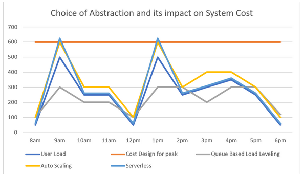

# Advantages of the cloud
Zes voordelen van cloud computing volgens Azure. 

## Keyterms
* 6 advantages of the cloud
    * SLA - Service level agreement
* Consumption-based model

## Opdracht
Bestudeer the 6 advantages of the cloud en het consumption-based model.

### Gebruikte bronnen
- [Achitecture](https://docs.microsoft.com/en-us/azure/architecture/framework/cost/design-price)
- [Adventages](https://docs.microsoft.com/en-us/learn/modules/fundamental-azure-concepts/benefits-of-cloud-computing)

### Ervaren problemen
Geen problemen ervaren.

### Resultaat
Flexibiliteit tussen CapEx en OpEx
Zes voordelen van de cloud:
1. High Availability
    * Afhankelijk van SLA kan zonder zichtbaar downtime, okal gingen dingen fout.
2. Scalability
    * Horizontaal schalen [^1]
    * Verticaal [^2]
3. Elasticity
    * Configuratie mogelijk om voordelen van autoscaling te gebruiken. 
4. Agility 
    * Verander en rol cloud-based recourses snel wanneer je app een verandering vereist.
5. Geo-distribution
    * Apps zijn uitrollen naar regionale datacenters over de hele wereld, zodat er altijd een goede preformance is in hun regio.
6. Disaster recovery
    * Verschillende services om te weten dat data veilig is bij een ramp; cloud-based backups services, data replicatie ne geo-distribution.

[^1]: Vergroten de rekencapaciteit door instances van resources toe te voegen.
[^2]: Vergroten van capaciteit door RAM of CPUs toe te voegen 

Consumption based model[^3] voordelen:
Je krijgt alleen kosten voor wat je gebruikt.
 * Geen kosten vooraf
 * Niet nodig om te betalen of regelen van prijzige infrastructuur die gebruikter misschien niet meer nodig hebben. 
 * De mogelijkheid om extra resources te betalen als dit nodig is.
 * De mogelijkheid om te stoppen met betalen voor resources die niet meer nodig zijn. 

[^3]: Eindgebruiker betaald alleen voor de resources die ze gebruiken. Wat ze gebruiken betalen ze voor.

