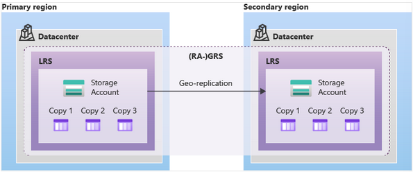
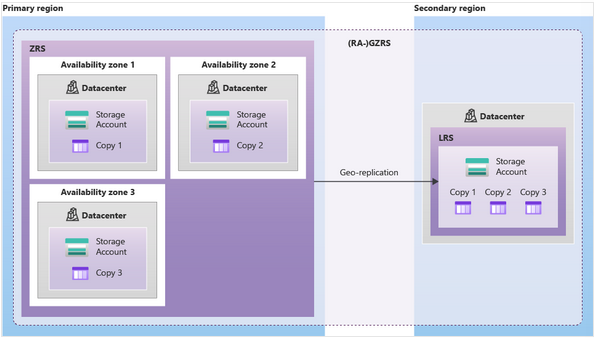

# Storage account

 Azure Storage platform is Microsoft's cloud storage oplossing voor moderne data storage senario's.  

## Keyterms

* SQL - System Query Languages
* NoSQL - niet relationele database
* Migratie van ongestructureerde data
  * NAS - Network Attached Storage.
* Migratie van bock-based apparatuur
  * SAN - Storage area networks

## Opdracht

Azure storage account aanmaken, een data in de storage service plaatsen via console en haal de data op naar je eigen computer via Azure Storage Explorer.

### Gebruikte bronnen

* [Core-storageservice](https://docs.microsoft.com/en-us/azure/storage/common/storage-introduction?toc=/azure/storage/blobs/toc.json)
* [Data-redundancy](https://docs.microsoft.com/en-us/azure/storage/common/storage-redundancy?toc=/azure/storage/blobs/toc.json)
* [NoSQL](https://azure.microsoft.com/nl-nl/overview/nosql-database/)

### Ervaren problemen

### Resultaat

Azure core Storage services:

* Azure Blobs
  * Storage service voor grote objecten zoals video files of bitmaps.
* Azure Files
  * Files shares kan toegang tot en gemanaged worden als file server.
* Azure Queues
  * Data store voor het in een wachtrij plaaten en op betrouwbare wijze afleveren van berichten tussen applicaties.
* Azure Tables
  * Service die non-relational structured data (NoSQL data) in de cloud opslaat, bieden van een key/attribute store met een schemaloos ontwerp.
* Azure Disks
  * Zorgt dat data aanhoudend geplaatst worden en bereikt kan worden door een verbonden virtual hard disk

Azure Storage redundancy:
    Azure bewaart altijd meerdere kopiën van de data zodat het beschermt is van geplande en ongeplande gebreurtenissen.

* Redundancy in primary region.
  * LRS - Locally redundant storage
    * Kopiëert de data drie keer op één fysieke locatie in de primaire regio.
    * Minst kostbaare replicatie optie, niet aangeraden voor toepassingen die high availability of durability nodig hebben.
  * ZRS - Zone-redundant storage
    * Kopiëert de data synchroon over drie Azure availibility zones in de primaire regio
    * Aangeraden voor toepassingen die een hoge availibility nodig hebben.

* Redundancy in secondary region.
  * GRS - Geo-redundant storage
    * Gegevens worden drie keer synchroon gekopiëerd op één fysieke locatie (LRS), en de gegevens worden asynchroon gekopiëerd naar een fysieke locatie in het secundaire gebied. In het secundaire gebied worden gegevens drie keer synchroon gekopiëerd met LRS. 
  * GZRS - Geo-zone-redundant storage
    * Gegevens worden drie keer synchroon gekopiëerd in drie Availibility zones (ZRS) en vervolgens asynchoon gekopiëerd naar secundair gebied waar ze driemaal synchroon gekopiëerd worden met LRS. 

LRS-GRS:

ZRS-GZRS:
