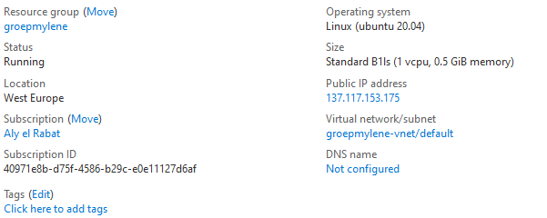
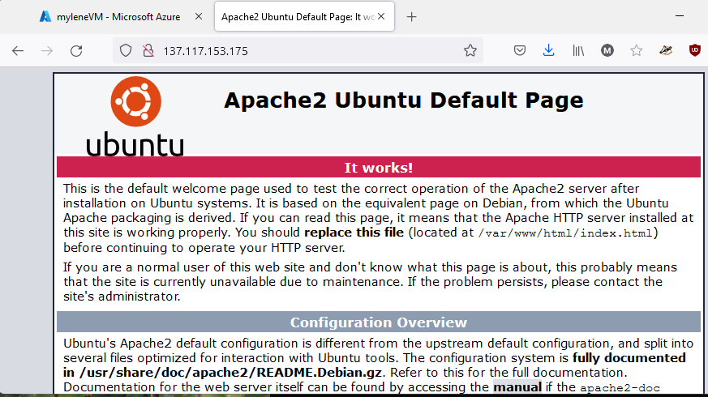

# Azure virtual machines

Azure virtual machines is de servers waarbij je VM's kan gebruiken die alleen bereikbaar zijn via het internet. 

### Keyterms
* SSH - Secure Shell (linux)
* RDP - Remote Desktop Protocol (windows)
* Load balacer - ADC
* IOPS - Input/Output Operations Per Second

## Opdracht

Maak via de Azure Console een VM aan, maak een apache server aan en controleer of je server werkt.

### Gebruikte bronnen

- [Network-security](https://docs.microsoft.com/en-us/azure/virtual-network/network-security-groups-overview)
- [VM-AzureCLI](https://docs.microsoft.com/en-us/azure/virtual-machines/windows/quick-create-cli)
- [VM-CLI](https://docs.microsoft.com/en-us/cli/azure/vm?view=azure-cli-latest#az_vm_create)

### Ervaren problemen


### Resultaat
In het Azure portal kan je op twee verschillende manieren een VM aanmaken.

1. Via de Azure CLI
    * Azure Cloud Shell

``` powershell 
# make resourcegroup
az group create --name groupmylene --location westeu

# create VM
az vm create \
    --resourcegroup groupmylene \
    --name myleneVM \ 
    --image UbuntuLTS \
    --public-ip-sku Standard \
    --admin-username

# Open HTTP port
az vm open-port --port 80 --resource-group groupmylene --name myleneVM

# clean-up resources
az group delete --name groupmylene
```

2. Via de Azure console.

- VM aanmaken met de vereisten.



- Ingelogd op VM met SSH via powershell
- Apache websurver geinstalleerd en aangezet. 
- Gecontroleerd of server werkt door public-IP in te voeren.



- VM verwijderd.