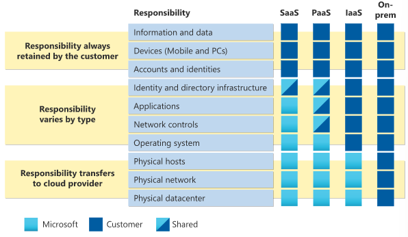
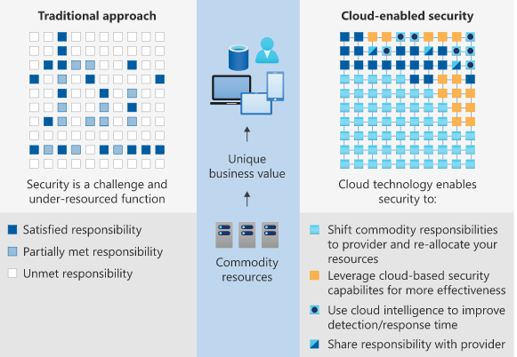

# Shared Responsibility Model
Bij het Shared Responibility model is zowel de cloud privider als de klant gedeeltelijk verantwoordelijk.

## Keyterms
- NIST - National Instutute of Standards and Technology (US)

## Opdracht
Bestudeer het Azure Shared Responsibility model.

### Gebruikte bronnen
- [Shared-responsibility](https://docs.microsoft.com/en-us/azure/security/fundamentals/shared-responsibility)
- [Shared-forcloud](https://azure.microsoft.com/mediahandler/files/resourcefiles/shared-responsibility-for-cloud-computing/Shared%20Responsibility%20for%20Cloud%20Computing-2019-10-25.pdf)

### Ervaren problemen
Documentatie waarna gelinkt wordt voor verdere informatie lijkt te zijn verouderd. 

### Resultaat
Er kan op verschillende niveau's van de cloud een Shared Responsibility zijn, dit is afhankelijk van de implementatie.

NIST definieerd cloud computing als service delivery model die de volgende karaktereigenschappen hebben:
- On-demand self-service
- Broad network access
- Resource pooling
- Rapid elasticy

NIST definieerd drie primaire cloud services delivery mechanisme:
- IaaS | Infrastrucure as a service
- PaaS | Platform as a service
- SaaS | Software as a service

De gebieden van responsibilities tussen de gebruiker en microsoft, volgens de gekozen implemenatie. 

De klant is altijd verantwoordelijk voor zijn eigen data en identiteiten. De klant is ongeacht de implementatie altijd verantwoordelijk voor:
- Gegevens
- Eindpunten
- Rekening
- Toegangsbeheer

Het Shared responsibility model zorgt ook voor meer duidelijkheid m.b.t. de beveiliging. In de traditional approach waren aan veel security eisen niet voldaan, door teweinig resources. In de cloud-enabled approach kunnen de verantwoordelijkheden mbt beveiliging dag op dag verschuiven naar de cloudprovider en de resources opnieuw toegewezen worden. 

