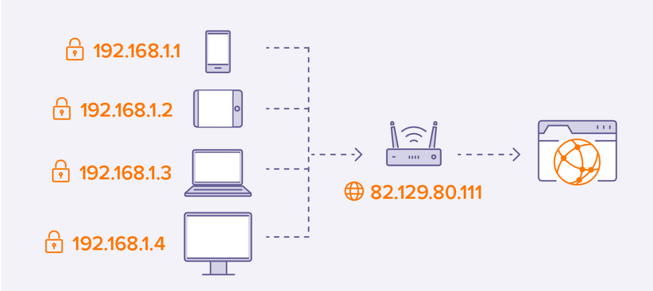

# IP adressen
IP adress staat voor Internet Protocol Address en heeft twee voornaamste functies, Netwerk Interface Identificatie en Location Addressing

## Keyterms

* Dual Stack
    * IPv4 & IPv6 kunnen niet met elkaar communiceren maar bestaan samen op het zelfde netwerk.
* Checksum 
    * Gebruikt om fouten te detecteren die mogelijk zijn geïntroduceerd tijdens verzending of opslag.
    * Wordt opgeslagen in de IP header van een IPv4
* IPv4
    * ARP - Address Resoltion Protocol
    * VLSP - Variable Length Subnet Mask
* IPv6
    * IPng - IP next generation
    * NDP - Neighbour Discovery Protocol
* NAT - Network Address Translation
    * Het proces waar het netwerkproces, gewoonlijk een firewall, wijst een publiek adress aan aan een computer (of een groep computers) binnen een privenetwerk. 
    * Zorgt voor een limiet aan het nummer IP adressen die een organisatie of bedrijf moet gebruiken voor economische en veiligheidsredenen.

## Opdracht

### Gebruikte bronnen
- [IP-adres](https://whatismyipaddress.com/)
- [IPv4-IPv6](https://www.guru99.com/difference-ipv4-vs-ipv6.html)
- [Verschil-prive/publiek](https://www.avg.com/en/signal/public-vs-private-ip-address)
- [Checksum](https://www.ibm.com/docs/en/zvm/7.2?topic=verification-tcpip-checksum-testing)

### Resultaat
Een IP adress is een numeriek label die aan ieder apparaat dat is verbonden met een computernetwerk dat IP protocol voor communicatie gebruikt. 

IP specificeert het technische formaat van het adresserings- en pakketschema. De meeste netwerken combineren IP met een TCP (Transmission Control Protocol). Het maakt het ook mogelijk om een virtuele verbinding tussen een bestemming en een bron te ontwikkelen.

#### Publiek IP adress
* Wordt gebruikt om van binnenuit het netwerk te verbinden naar buiten het netwerk.

#### Privat IP
Het tekort aan IPv4 adressen leide tot het delen van een extern IP.
* Elk apparaat binnen het zelfde netwerk moet een uniek adress hebben en wordt door de router toegewezen aan alle apparaten binnen het eigen netwerk.
    * Wordt gebruikt om apparaten binnen het interne netwerk met elkaar te laten communiceren 
* Prive IP adressen moeten alleen uniek zijn binnen het locale netwerk.

In de windows powershel kan je het commando `ipconfig` invoeren om je eigen prive IP adres te vinden. 
 

#### IPv4 vs IPv6
Om de behoefte aan meer internet adressen te voldoen is IPv6 ontwikkeld. 

Features IPv4:
- Connectionless Protocol
- Allow creating a simple virtual communication layer over diversified devices
- It requires less memory, and ease of remembering addresses
- Already supported protocol by millions of devices
- Offers video libraries and conferences

Features IPv6:
- Hierarchical addressing and routing infrastructure
- Stateful and Stateless configuration
- Support for quality of service (QoS)
- An ideal protocol for neighboring node interaction

Belangrijke verschillen:
| Onderwerp | IPv4 | IPv6 |
| ----- | ----- | ---- |
| Grote IP adres | 32-bit IP | 128-bit IP |
| Opbouw adres | numeric | alpanumeric |
| Seperatie methode | dot(.) | collon (:) |
| Map MAC address | ARP | NDP |

#### Remove public IP

