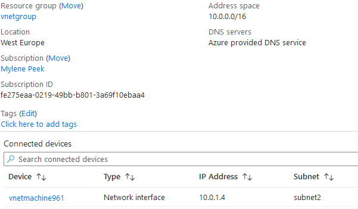
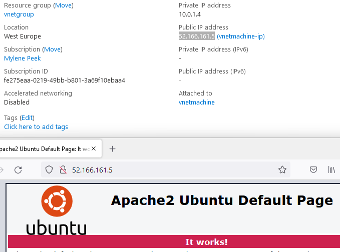

# Azure Virtual Network
Azure virtual networks (VNets) is een logische isolated section van het Azure Netwerk waar de klant zijn Azure resources.

### Keyterms
* VPN - Virtual Private Network
* CIDR Range - Classless Inter-Domain Routing

## Opdracht
Zet een virtueel netwerk op met een vm in subnet 2. 

### Gebruikte bronnen
- [Azure Virtual Network](https://docs.microsoft.com/en-us/azure/virtual-network/virtual-networks-overview)

### Resultaat
Azure virtual network zorgt ervoor dat Azure resources securely kunnen communiceren met elkaar, het internet en on-premises netwerken.

Meeste Azure diensten hebben een vNet nodig om de resources ergens neer te zetten. 
* Subnets zijn een logische partitie van een IP netwerk in meerdere smallere netwerk segmenten
* Subnets hebben een kleinere CIDR bereik het de vNet represent their portion. 
    * Public Subnet - kan het interent bereiken
    * Private Subnet - kan het interent niet bereiken

3 manieren om on-premmises met netwerk te verbinden
* Point-to-site VPN
* Side-to-side VPN
* Azure Expressroute

1. Maak een virtual netwerk.

2. Maak een VM en controleer of de website bereikbaar is.

