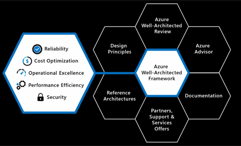

# Well-Architected Framework
Well-Architected Framework is een set van best practice guidance die een paar rollen aanspreek t binnen elke organisatie om hun workloads te identificeren en optimaliseren. 

### Keyterms

## Opdracht
Beschrijf het Well-Architected Framework van Azure.

### Gebruikte bronnen
- [Azure Well Architected Framework](https://docs.microsoft.com/en-us/azure/architecture/framework/)
- [Introduction Well Architected Framework](https://azure.microsoft.com/nl-nl/blog/introducing-the-microsoft-azure-wellarchitected-framework/)
- [Well-Architected Microsoft Azure](https://www.microsoft.com/azure/partners/well-architected)

### Resultaat

De Well-Architected Framework kent vijf pilaren:
1. Cost optimization
    * Managen van costen om de waarde te maximaliseren.
2. Reliability
    * Het vermogen van het systeem om te herstellen van failures en de functie door te laten gaan.
3. Operational Excelence
    * Operatie processen die een systeem draaiende en in productie houden.
4. Performance efficiency
    * Het vermogen van een systeem om zich aan te passen aan veranderingen in load.
5. Security
    * Beschermen van toepassingen en data van dreigingen.

Naast de vijf pilaren zijn er zes suportende elementen:
* Azure Well-Architected Review
* Azure Advisor
* Documentation
* Partners, Support en Service Offers
* Reference Architectures
* Design Principles

#### Implementatie met clouddiensten

1. Cost optimization
Het zoeken naar een manier om onnodige kosten te verminderen en operationele efficiëntie te verbeteren. 

2. Reliability
Een betrouwbaare workload is resilent en availible
* Resilient
  * Het vermogen van het systeem om te herstellen van storingen en te flijven functioneren.
  * Doel om de toepassing na een storing naar een volledig functionerende staat te brengen.
* Available
  * Of de gebruikers toegang hebben tot hun werk wanneer dat moet. 

3. Operational Excelence
De operations en processes die ervoor zorgen dat een aplicatie in productie blijft.
* Moeten betrouwbaar en voorspelbaar zijn

4. Preformance efficiency
Op de juiste manier gebruik maken van schaling en het implementeren van PaaS-aanbiedingen waarin schaling is ingebouwd.

5. Security
Het Azure platform zorgt voor bescherming tegen verschillende dreigingen zoals netwerk intrusion en DDoS aanvallen.
* Gebruiker moet nog security in zn applicatie an in de DevOps processen toepassen. 
